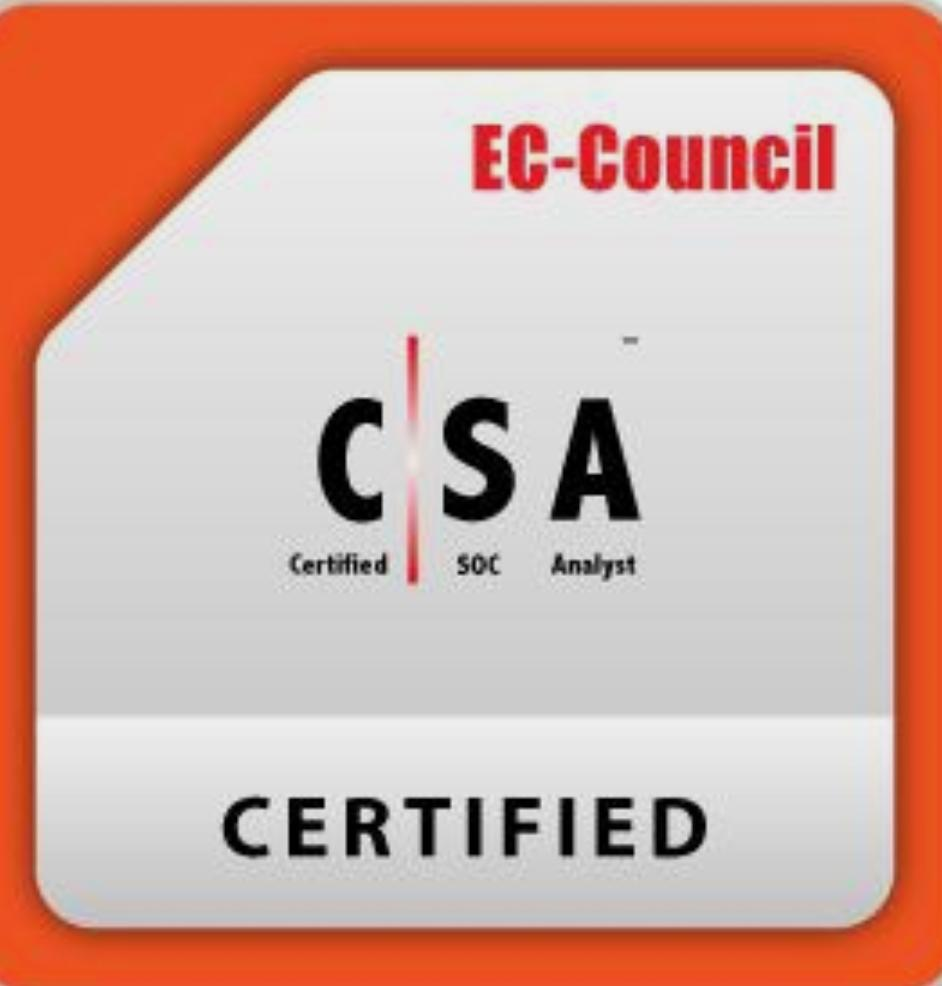

<h1 align="center">Hi 👋, I'm Hashim</h1>
<h3 align="center">IT & Cybersecurity Professional | Linux Admin | Defensive Security Enthusiast</h3>

  
  
  

---

## 👨‍💻 About Me

I'm an IT and cybersecurity professional passionate about **network infrastructure**, **defensive security**, and **system administration**. I enjoy solving complex problems, securing environments, and writing automation scripts to make daily operations more efficient and reliable.

- 🔐 Building secure network infrastructures and robust backup policies
- 🐧 Writing **Bash/Shell scripts** to streamline Linux system administration
- 📚 Continuously expanding my toolkit in **DevOps** and **cybersecurity**
- 🛡️ Focused on **defensive security** — protect, detect, respond

---

## 🛠️ Tech Stack & Tools

  
  
  
  
  
  
  

---

## 🗂️ Featured Projects

| Project | Description |
|--------|-------------|
| 🔧 [**Automated Linux Backup System**](https://github.com/hashimkm-sec/Projects/tree/3da5808dec43ff76e5f5938ffa3db71c19266b7d/automated-directory-backup) | A Bash-based automated backup solution with scheduling, logging, and retention policies |

> 📂 Explore all my hands-on technical work in my [**Projects Repository →**](https://github.com/hashimkm-sec/Projects)

---

## 🏅 Certifications

<table>
  <tr>
    <td align="center">
      <a href="https://www.credly.com/badges/c93f64bb-e577-4bad-bf79-52d76d550c15/public_url" target="_blank">
        
         
        <b>Linux Commands & Shell Scripting Essentials V2</b>
      </a>
       
      📜 Coursera · Verified by Credly
    </td>
    <td align="center">
      <a href="https://www.credly.com/badges/1763101e-7387-41d2-b102-17c7298750c4/public_url" target="_blank">
        
         
        <b>Git and GitHub Essentials</b>
      </a>
       
      📜 Coursera · Verified by Credly
    </td>
    <td align="center">
      
       
      <b>Certified SOC Analyst (CSA)</b>
       
      🛡️ EC-Council · Certified
    </td>
  </tr>
</table>

---

## 📊 GitHub Stats

  
  

---

  <i>"Security is not a product, but a process." – Bruce Schneier</i>

